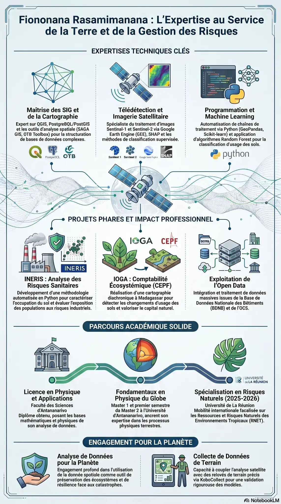

  

<h1 align="center">👋 Salut, je suis Fiononana</h1>

<h3 align="center">Expert en Géomatique, Télédétection et Analyse de Données</h3>

  

---

### 👨‍💻 À propos de moi

- 🔭 Je suis un professionnel passionné par l'analyse de données géospatiales, la télédétection et le machine learning.
- 🌱 J'explore constamment de nouvelles approches pour résoudre des problèmes complexes liés à la Terre et à la gestion des risques.
- 💬 N'hésitez pas à me contacter pour discuter de projets ou de collaborations.
- 📫 Comment me joindre : Vous pouvez me trouver sur GitHub [@fy0500](https://github.com/fy0500).

---

### 📊 Statistiques GitHub

  
  

 

  

---

### 🌟 Mon Expertise en un Coup d'Œil

  

---

### 🛠️ Langages et Outils Clés

  

- **SIG & Cartographie :** QGIS, PostgreBQL/PostGIS, SAGA GIS, OTB Toolbox
- **Télédétection :** Google Earth Engine (GEE), Sentinel-1, Sentinel-2, SHAP
- **Programmation :** Python (GeoPandas, Scikit-learn), JavaScript
- **Outils :** Git, GitHub, Docker, Linux

---

### 🎓 Parcours Académique

- **Spécialisation en Risques Naturels (2025-2026)** : Université de La Réunion (Mobilité internationale sur les Ressources et Risques Naturels des Environnements Tropicaux - RNET).
- **Fondamentaux en Physique du Globe (Master 1 & 2)** : Université d'Antananarivo (expertise en processus physiques terrestres).
- **Licence en Physique et Applications** : Faculté des Sciences d'Antananarivo (bases mathématiques et physiques pour l'analyse de données).

---

### 🌍 Engagement pour la Planète

- **Analyse de Données pour la Planète :** Utilisation de la donnée spatiale pour la préservation des écosystèmes et la résilience face aux catastrophes.
- **Collecte de Données de Terrain :** Couplage de l'analyse satellite avec des relevés de terrain via KoboCollect pour la validation des modèles.

---

### 📁 Projets Phares

- **[My-work](https://github.com/fy0500/My-work)** : Projets et travaux d'analyse (Principalement en Jupyter Notebook et JavaScript).
- **INERIS : Analyse des Risques Sanitaires :** Développement d'une méthodologie automatisée en Python pour caractériser l'occupation du sol et évaluer l'exposition des populations aux risques industriels.
- **IOGA : Comptabilité Écosystémique (CEPF) :** Cartographie diachronique à Madagascar pour détecter les changements d'usage des sols et valoriser le capital naturel.
- **Exploitation de l'Open Data :** Intégration et traitement de données massives (BDNB, OCS).

 

  <i>Généré avec ❤️ pour améliorer mon profil GitHub</i>

