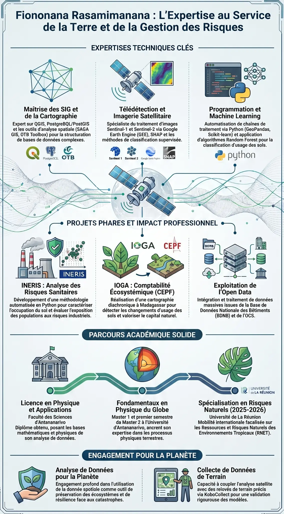

  

<h1 align="center">Bienvenu dans mon espace github</h1>

<h3 align="center">Expertise au Machine Learning et de la Gestion des Bases des données</h3>

  

---

## Présentation Générale

Ce profil présente mes compétences, projets et parcours académique, un professionnel spécialisé dans l'analyse de données géospatiales, la télédétection et le machine learning, avec un engagement marqué pour la gestion des risques et la préservation de l'environnement.

---

## Synthèse des Compétences et Projets

  

---

## Expertises Techniques Clés

### Maîtrise du SIG et de la Cartographie
Expert sur QGIS, PostgreSQL/PostGIS et les outils d'analyse spatiale (SAGA GIS, OTB Toolbox) pour la structuration de bases de données complexes.

### Télédétection et Imagerie Satellitaire
Spécialiste du traitement d'images Sentinel-1 et Sentinel-2 via Google Earth Engine (GEE), SHAP et les méthodes de classification supervisée.

### Programmation et Machine Learning
Automatisation de chaînes de traitement via Python (GeoPandas, Scikit-learn) et application d'algorithmes Random Forest pour la classification d'usage des sols.

---

## Technologies et Outils

  
  
  
  
  
  
  
  
  

---

## Projets Phares et Impact Professionnel

### INERIS : Analyse des Risques Sanitaires
Développement d'une méthodologie automatisée en Python pour caractériser l'occupation du sol et évaluer l'exposition des populations aux risques industriels.

### IOGA : Comptabilité Écosystémique (CEPF)
Réalisation d'une cartographie diachronique à Madagascar pour détecter les changements d'usage des sols et valoriser le capital naturel.

### Exploitation de l'Open Data
Intégration et traitement de données massives issues de la Base de Données Nationale des Bâtiments (BDNB) et de l'OCS.

---

## Parcours Académique Solide

### Licence en Physique et Applications
Faculté des Sciences d'Antananarivo. Diplôme obtenu, posant les bases mathématiques et physiques de son analyse de données.

### Fondamentaux en Physique du Globe
Master 1 et premier semestre du Master 2 à l'Université d'Antananarivo, ancrant son expertise dans les processus physiques terrestres.

### Spécialisation en Risques Naturels (2025-2026)
Université de La Réunion. Mobilité internationale focalisée sur les Ressources et Risques Naturels des Environnements Tropicaux (RNET).

---

## Engagement pour la Planète

### Analyse de Données pour la Planète
Engagement profond dans l'utilisation de la donnée spatiale comme outil de préservation des écosystèmes et de résilience face aux catastrophes.

### Collecte de Données de Terrain
Capacité à coupler l'analyse satellite avec des relevés de terrain précis via KoboCollect pour une validation rigoureuse des modèles.

---

## 📊 Statistiques GitHub

  

   
 

---

## Projets Récents

- **[My-work](https://github.com/fy0500/My-work)** : Projets et travaux d'analyse (Principalement en Jupyter Notebook et JavaScript).

 

  <i>Généré pour améliorer mon profil GitHub</i>

